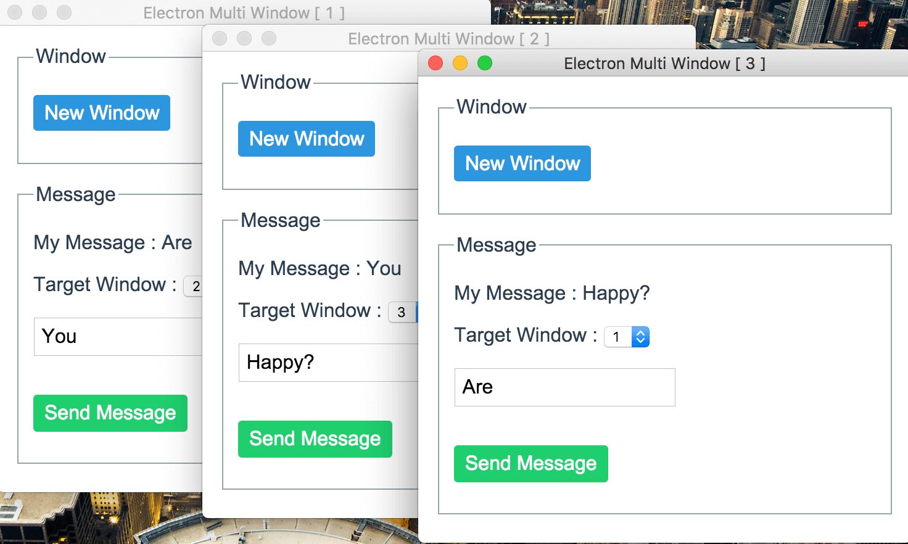

# examples-electron

Examples for Electron applications.

## Electron Starter Kit

This is a starter kit of the Electron application development.

* [electron-starter](./electron-starter)
* Blog
 * [Electron を試す - 開発環境の構築](http://akabeko.me/blog/2015/09/electron/)
 * [Electron を試す 2 - パッケージ化におけるプラットフォーム固有処理とコンパイル分岐](http://akabeko.me/blog/2015/10/electron-2/)

## Audio Player

Example of simple audio player in Electron.

* [audio-player](./audio-player)
* Blog
 * [Electron を試す 3 - 簡易音楽プレーヤー](http://akabeko.me/blog/2015/10/electron-3/)
 * [Electron を試す 4 - 簡易音楽プレーヤー 2](http://akabeko.me/blog/2015/10/electron-4/)
 * [Electron を試す 5 - Electron v0.35.0 対応](http://akabeko.me/blog/2015/11/electron-5/)

# Multiple windows

Example to manage multiple windows in [Electron](http://electron.atom.io/).

* [multiple-windows](./multiple-windows)
* Blog
 * [Electron を試す 6 - 複数ウィンドウの管理](http://akabeko.me/blog/2015/12/electron-6/)
