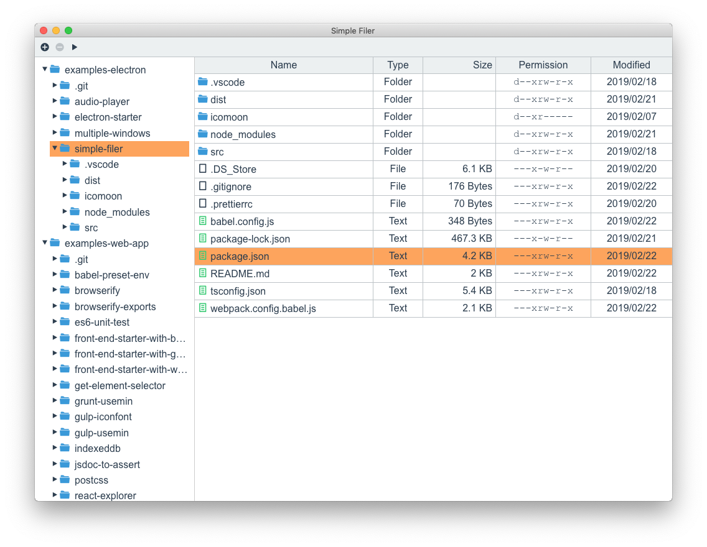

# examples-electron

Examples for Electron applications.

|Starter Kit|Audio Player|Multiple Window|Simple Filer|
|---|---|---|---|
|||||

## [Electron Starter Kit](./electron-starter)

This is a starter kit of the Electron application development.

- [Electron を試す - 開発環境の構築](https://akabeko.me/blog/2015/09/electron/)
- [Electron を試す 2 - パッケージ化におけるプラットフォーム固有処理とコンパイル分岐](https://akabeko.me/blog/2015/10/electron-2/)

## [Audio Player](./audio-player)

Example of simple audio player on Electron.

- [Electron を試す 3 - 簡易音楽プレーヤー](https://akabeko.me/blog/2015/10/electron-3/)
- [Electron を試す 4 - 簡易音楽プレーヤー 2](https://akabeko.me/blog/2015/10/electron-4/)
- [Electron を試す 5 - Electron v0.35.0 対応](https://akabeko.me/blog/2015/11/electron-5/)

## [Multiple Window](./multiple-windows)

Example to manage multiple windows on [Electron](https://electron.atom.io/).

- [Electron を試す 6 - 複数ウィンドウの管理](https://akabeko.me/blog/2015/12/electron-6/)

## [Simple Filer](./simple-filer)

Example to simple filer on [Electron](https://electron.atom.io/).

- [Electron を試す 11 - 簡易ファイラー with TypeScript](https://akabeko.me/blog/2019/02/electron-11/)
