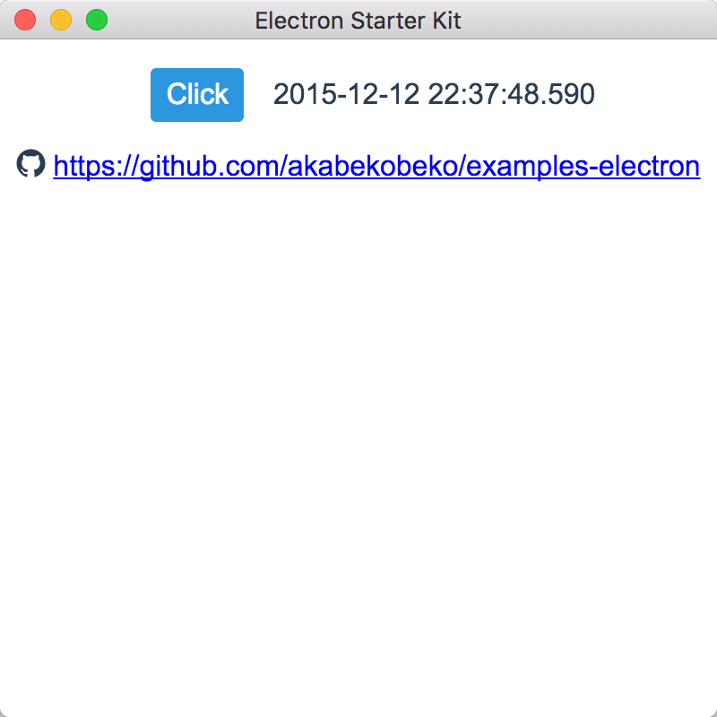

# Electron Starter Kit

[](https://github.com/prettier/prettier)

This is a starter kit of the [Electron](http://electron.atom.io/) application development.



## Installation

1. Install [Node.js](https://nodejs.org/)
2. `cd PROJECTDIR`
3. `npm install`

## Development

### Watch

Run the watch files, background complie JavaScript/TypeScript/CSS.

```bash
npm start
```

## Launch application

Launch the Electron app on [electron](https://www.npmjs.com/package/electron). Target for the src dir.

```bash
npm run app
```

### Unit test

Run the ES6 code of unit tests on [mocha](https://www.npmjs.com/package/mocha) with [power-assert](https://www.npmjs.com/package/power-assert) and [espower-typescript](https://www.npmjs.com/package/espower-typescript).

```bash
npm test
```

## Release build

Build the app for production. Please build individually because there is a platform-specific processing.

```bash
npm run release:mac
npm run release:win
npm run release:linux
```

or

```bash
npm run release:build
npm run release:pack-mac
npm run release:pack-win
npm run release:pack-linux
```

It is also will be skipped by running the `release:mac` or `release:pack-mac` in the Windows environment.

### Package for Windows in macOS

How to build a package for Windows in macOS. Introduction you will install the [WineHQ](https://www.winehq.org/). It is recommended that you use the [Homebrew](http://brew.sh/).

```bash
brew install wine
```

Then run the following command. If it is correct environment you should succeed to build the package for Windows.

```bash
npm run release:win
```

or

```bash
npm run release
```

`release` is a package for all platforms.

## ifdef DEBUG

Supports preprocessing with [ifdef-loader](https://www.npmjs.com/package/ifdef-loader).

```js
/// #if env == 'DEBUG'
console.log('DEBUG!!!')
/// #endif
```

This process will be removed in a release version.

## License

[MIT](LICENSE)
